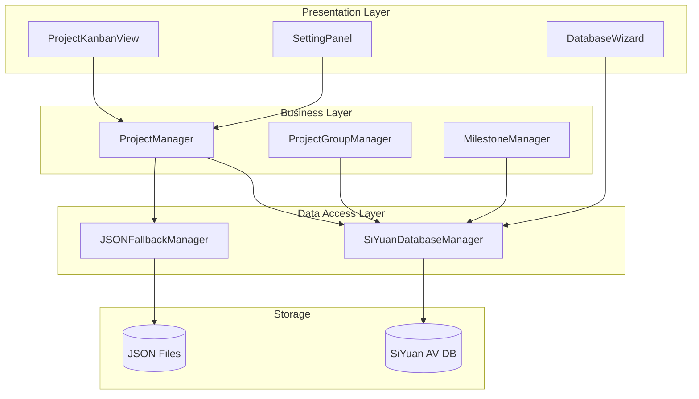

# Design Document: SiYuan Database Migration

## Overview

本设计文档定义从JSON文件存储迁移到SiYuan Attribute View (AV) 数据库的技术方案。核心目标是在保持现有功能不变的前提下，将项目、分组、里程碑等核心数据迁移到SiYuan数据库，同时提供双模式支持（JSON/数据库）以确保向后兼容。

## Code Reuse Analysis

### Existing Components to Leverage

- **ProjectManager** (`src/utils/projectManager.ts`): 保留现有接口，内部实现改为调用SiYuanDatabaseManager
- **ProjectGroupManager** (`src/utils/projectGroupManager.ts`): 同样保留接口，底层切换到数据库
- **api.ts** (`src/api.ts`): 扩展SiYuan API封装，添加数据库相关方法
- **ProjectKanbanView** (`src/components/ProjectKanbanView.ts`): 事件处理逻辑更新为调用新的数据层

### Integration Points

- **SiYuan Kernel API**: 通过 `/api/av/getAttributeView`, `/api/av/setAttributeViewBlockAttr` 等端点
- **Plugin Data API**: 保留 `loadData/saveData` 作为降级方案
- **Block Attributes**: 继续通过 `custom-task-projectid` 等属性关联任务块

## Architecture

### High-Level Architecture



### Key Design Principles

1. **透明迁移**: 现有Manager类接口保持不变，调用方无感知
2. **双模式运行**: 支持JSON和数据库两种存储模式，可动态切换
3. **数据库优先**: 当数据库可用时优先使用，JSON作为降级
4. **批量优化**: 利用SiYuan的批量API减少请求次数
5. **错误降级**: 数据库操作失败自动回退到JSON

## Components and Interfaces

### 1. SiYuanDatabaseManager

**Purpose:** 统一封装所有SiYuan数据库操作，提供类型安全的API

**Location:** `src/utils/siYuanDatabaseManager.ts`

**Interfaces:**

```typescript
class SiYuanDatabaseManager {
    // 单例模式
    static getInstance(plugin: Plugin): SiYuanDatabaseManager;
    
    // 数据库连接管理
    async initialize(config: DatabaseConfig): Promise<boolean>;
    async isAvailable(): Promise<boolean>;
    
    // 项目操作
    async getAllProjects(): Promise<Project[]>;
    async getProjectById(id: string): Promise<Project | null>;
    async createProject(project: Omit<Project, 'id'>): Promise<Project>;
    async updateProject(id: string, updates: Partial<Project>): Promise<Project>;
    async deleteProject(id: string): Promise<boolean>;
    
    // 分组操作
    async getGroupsByProject(projectId: string): Promise<ProjectGroup[]>;
    async createGroup(group: Omit<ProjectGroup, 'id'>): Promise<ProjectGroup>;
    async updateGroup(id: string, updates: Partial<ProjectGroup>): Promise<ProjectGroup>;
    async deleteGroup(id: string): Promise<boolean>;
    
    // 里程碑操作
    async getMilestonesByProject(projectId: string): Promise<Milestone[]>;
    async createMilestone(milestone: Omit<Milestone, 'id'>): Promise<Milestone>;
    async updateMilestone(id: string, updates: Partial<Milestone>): Promise<Milestone>;
    
    // 批量操作
    async batchUpdateProjects(updates: Array<{id: string, data: Partial<Project>}>): Promise<void>;
    async batchUpdateGroups(updates: Array<{id: string, data: Partial<ProjectGroup>}>): Promise<void>;
    
    // 数据库元数据
    async getDatabaseSchema(): Promise<DatabaseSchema>;
    async validateSchema(): Promise<SchemaValidationResult>;
}
```

**Dependencies:**
- Plugin实例（用于调用SiYuan API）
- api.ts中的扩展方法

### 2. DatabaseConfig & StorageMode

**Purpose:** 配置数据库连接和存储模式

**Location:** `src/types/database.ts`

```typescript
interface DatabaseConfig {
    // 数据库块ID（用户配置或自动检测）
    projectDatabaseId?: string;
    groupDatabaseId?: string;
    milestoneDatabaseId?: string;
    
    // 自动创建数据库选项
    autoCreateDatabases: boolean;
    
    // 存储模式
    storageMode: StorageMode;
    
    // 降级策略
    fallbackOnError: boolean;
    
    // 缓存配置
    cacheEnabled: boolean;
    cacheTTL: number; // 毫秒
}

enum StorageMode {
    JSON_ONLY = 'json_only',           // 仅JSON（默认）
    DATABASE_ONLY = 'database_only',   // 仅数据库
    HYBRID = 'hybrid'                  // 双写模式（迁移用）
}
```

### 3. ProjectManager (Refactored)

**Purpose:** 保持现有接口，内部调用SiYuanDatabaseManager

**Location:** `src/utils/projectManager.ts` (修改)

**Changes:**
```typescript
class ProjectManager {
    private dbManager: SiYuanDatabaseManager;
    private fallbackManager: JSONFallbackManager;
    private storageMode: StorageMode;
    
    async loadProjects(): Promise<void> {
        if (this.shouldUseDatabase()) {
            this.projects = await this.dbManager.getAllProjects();
        } else {
            this.projects = await this.fallbackManager.loadProjects();
        }
    }
    
    async saveProjects(): Promise<void> {
        if (this.storageMode === StorageMode.HYBRID) {
            // 双写模式
            await Promise.all([
                this.dbManager.batchUpdateProjects(this.projects.map(p => ({id: p.id, data: p}))),
                this.fallbackManager.saveProjects(this.projects)
            ]);
        } else if (this.shouldUseDatabase()) {
            // 已批量更新，无需额外操作
        } else {
            await this.fallbackManager.saveProjects(this.projects);
        }
    }
    
    private shouldUseDatabase(): boolean {
        return this.storageMode === StorageMode.DATABASE_ONLY || 
               this.storageMode === StorageMode.HYBRID;
    }
}
```

### 4. DataMigrationWizard

**Purpose:** 图形化数据迁移向导

**Location:** `src/components/DataMigrationWizard.ts`

**Interfaces:**
```typescript
class DataMigrationWizard {
    constructor(plugin: Plugin, dbManager: SiYuanDatabaseManager);
    
    // 显示迁移向导
    show(): void;
    
    // 执行迁移
    async executeMigration(options: MigrationOptions): Promise<MigrationResult>;
    
    // 验证数据
    async validateData(): Promise<ValidationReport>;
    
    // 回滚迁移
    async rollback(): Promise<boolean>;
}

interface MigrationOptions {
    migrateProjects: boolean;
    migrateGroups: boolean;
    migrateMilestones: boolean;
    backupBeforeMigrate: boolean;
    dryRun: boolean;
}

interface MigrationResult {
    success: boolean;
    migratedProjects: number;
    migratedGroups: number;
    migratedMilestones: number;
    errors: MigrationError[];
}
```

### 5. DatabaseTemplate

**Purpose:** 预定义的数据库模板，用于自动创建数据库

**Location:** `src/templates/databaseTemplates.ts`

```typescript
export const ProjectDatabaseTemplate = {
    name: '项目管理',
    columns: [
        { name: '项目名称', type: 'text', required: true },
        { name: '项目状态', type: 'mSelect', options: [
            { content: '进行中', color: '#e74c3c' },
            { content: '短期', color: '#3498db' },
            { content: '长期', color: '#9b59b6' },
            { content: '已完成', color: '#2ecc71' }
        ]},
        { name: '优先级', type: 'mSelect', options: [
            { content: '高', color: '#e74c3c' },
            { content: '中', color: '#f39c12' },
            { content: '低', color: '#2ecc71' },
            { content: '无', color: '#95a5a6' }
        ]},
        { name: '项目颜色', type: 'text' },
        { name: '看板模式', type: 'mSelect', options: [
            { content: '状态模式', color: '#3498db' },
            { content: '自定义分组', color: '#9b59b6' },
            { content: '列表模式', color: '#95a5a6' }
        ]},
        { name: '开始日期', type: 'date' },
        { name: '创建时间', type: 'date' }
    ]
};
```

## Data Models

### Database to TypeScript Mapping

#### Project Model

```typescript
// JSON存储中的Project
interface Project {
    id: string;
    name: string;
    status: string;  // 'doing' | 'short_term' | 'long_term' | 'completed'
    color?: string;
    kanbanMode?: 'status' | 'custom' | 'list';
    customGroups?: ProjectGroup[];
    milestones?: Milestone[];
    priority?: 'high' | 'medium' | 'low' | 'none';
    sort?: number;
    startDate?: string;
    createdTime?: string;
    categoryId?: string;
}

// 数据库行结构
interface ProjectDatabaseRow {
    id: string;           // 行ID
    '项目名称': { text: { content: string } };
    '项目状态': { mSelect: Array<{ content: string; color: string }> };
    '优先级': { mSelect: Array<{ content: string; color: string }> };
    '项目颜色': { text: { content: string } };
    '看板模式': { mSelect: Array<{ content: string; color: string }> };
    '开始日期': { date: { content: number; isNotEmpty: boolean } };
    '创建时间': { date: { content: number; isNotEmpty: boolean } };
}
```

#### Conversion Functions

```typescript
// 数据库行 → Project对象
function rowToProject(row: any): Project {
    const statusMap: Record<string, string> = {
        '进行中': 'doing',
        '短期': 'short_term',
        '长期': 'long_term',
        '已完成': 'completed'
    };
    
    const priorityMap: Record<string, string> = {
        '高': 'high',
        '中': 'medium',
        '低': 'low',
        '无': 'none'
    };
    
    const modeMap: Record<string, string> = {
        '状态模式': 'status',
        '自定义分组': 'custom',
        '列表模式': 'list'
    };
    
    return {
        id: row.id,
        name: row['项目名称']?.text?.content || '',
        status: statusMap[row['项目状态']?.mSelect?.[0]?.content] || 'doing',
        color: row['项目颜色']?.text?.content,
        kanbanMode: modeMap[row['看板模式']?.mSelect?.[0]?.content] || 'status',
        priority: priorityMap[row['优先级']?.mSelect?.[0]?.content] || 'none',
        startDate: row['开始日期']?.date?.content 
            ? new Date(row['开始日期'].date.content).toISOString()
            : undefined,
        createdTime: row['创建时间']?.date?.content
            ? new Date(row['创建时间'].date.content).toISOString()
            : new Date().toISOString()
    };
}

// Project对象 → 数据库更新值
function projectToRowValues(project: Partial<Project>): Record<string, any> {
    const statusReverseMap: Record<string, string> = {
        'doing': '进行中',
        'short_term': '短期',
        'long_term': '长期',
        'completed': '已完成'
    };
    
    const priorityReverseMap: Record<string, {content: string; color: string}> = {
        'high': { content: '高', color: '#e74c3c' },
        'medium': { content: '中', color: '#f39c12' },
        'low': { content: '低', color: '#2ecc71' },
        'none': { content: '无', color: '#95a5a6' }
    };
    
    const modeReverseMap: Record<string, {content: string; color: string}> = {
        'status': { content: '状态模式', color: '#3498db' },
        'custom': { content: '自定义分组', color: '#9b59b6' },
        'list': { content: '列表模式', color: '#95a5a6' }
    };
    
    const values: Record<string, any> = {};
    
    if (project.name !== undefined) {
        values['项目名称'] = { text: { content: project.name } };
    }
    if (project.status !== undefined) {
        values['项目状态'] = { 
            mSelect: [{ 
                content: statusReverseMap[project.status], 
                color: getStatusColor(project.status) 
            }] 
        };
    }
    if (project.priority !== undefined) {
        values['优先级'] = { mSelect: [priorityReverseMap[project.priority]] };
    }
    if (project.color !== undefined) {
        values['项目颜色'] = { text: { content: project.color } };
    }
    if (project.kanbanMode !== undefined) {
        values['看板模式'] = { mSelect: [modeReverseMap[project.kanbanMode]] };
    }
    if (project.startDate !== undefined) {
        values['开始日期'] = { 
            date: { 
                content: new Date(project.startDate).getTime(), 
                isNotEmpty: true 
            } 
        };
    }
    
    return values;
}
```

## Error Handling

### Error Scenarios

#### 1. Database Unavailable

**Scenario:** SiYuan数据库API返回错误或超时

**Handling:**
```typescript
async function withFallback<T>(
    dbOperation: () => Promise<T>,
    fallbackOperation: () => Promise<T>
): Promise<T> {
    try {
        return await dbOperation();
    } catch (error) {
        console.warn('Database operation failed, falling back to JSON:', error);
        if (config.fallbackOnError) {
            return await fallbackOperation();
        }
        throw error;
    }
}
```

**User Impact:** 
- 静默降级，用户无感知
- 在设置面板显示数据库状态指示器

#### 2. Schema Mismatch

**Scenario:** 数据库列结构与期望不符

**Handling:**
```typescript
async validateSchema(): Promise<SchemaValidationResult> {
    const schema = await this.getDatabaseSchema();
    const requiredColumns = ['项目名称', '项目状态', '优先级'];
    const missingColumns = requiredColumns.filter(col => 
        !schema.columns.some(c => c.name === col)
    );
    
    if (missingColumns.length > 0) {
        return {
            valid: false,
            errors: missingColumns.map(col => `缺少必需列: ${col}`)
        };
    }
    
    return { valid: true, errors: [] };
}
```

**User Impact:**
- 显示警告提示
- 提供一键修复选项（添加缺失列）

#### 3. Migration Failure

**Scenario:** 数据迁移过程中断

**Handling:**
```typescript
async executeMigration(options: MigrationOptions): Promise<MigrationResult> {
    const backup = await this.createBackup();
    const results: MigrationResult = { success: true, migratedProjects: 0, migratedGroups: 0, migratedMilestones: 0, errors: [] };
    
    try {
        if (options.migrateProjects) {
            results.migratedProjects = await this.migrateProjects();
        }
        if (options.migrateGroups) {
            results.migratedGroups = await this.migrateGroups();
        }
        // ...
    } catch (error) {
        results.success = false;
        results.errors.push({ type: 'MIGRATION_ERROR', message: error.message });
        
        if (options.backupBeforeMigrate) {
            await this.restoreFromBackup(backup);
        }
    }
    
    return results;
}
```

**User Impact:**
- 显示详细的错误日志
- 提供回滚选项
- 保留原始数据不变

#### 4. Concurrent Modification

**Scenario:** 用户在SiYuan数据库视图中修改数据，同时插件也修改了同一行

**Handling:**
```typescript
async updateProject(id: string, updates: Partial<Project>): Promise<Project> {
    // 获取当前版本
    const current = await this.getProjectById(id);
    
    // 乐观锁检查（通过比较更新时间）
    if (updates.lastModified && current.lastModified !== updates.lastModified) {
        throw new ConcurrentModificationError('数据已被外部修改，请刷新后重试');
    }
    
    // 执行更新
    return await this.dbManager.updateProject(id, updates);
}
```

**User Impact:**
- 显示冲突提示
- 提供"使用我的版本" / "使用服务器版本" / "合并"选项

## Testing Strategy

### Unit Testing

**Key Components to Test:**
1. **rowToProject / projectToRowValues**: 验证数据转换逻辑
2. **SiYuanDatabaseManager**: 模拟API响应，测试各种场景
3. **Migration Logic**: 测试数据迁移的正确性和回滚

**Example Test:**
```typescript
describe('rowToProject', () => {
    it('should convert database row to Project object', () => {
        const row = {
            id: 'test-id',
            '项目名称': { text: { content: '测试项目' } },
            '项目状态': { mSelect: [{ content: '进行中', color: '#e74c3c' }] },
            '优先级': { mSelect: [{ content: '高', color: '#e74c3c' }] }
        };
        
        const project = rowToProject(row);
        
        expect(project.id).toBe('test-id');
        expect(project.name).toBe('测试项目');
        expect(project.status).toBe('doing');
        expect(project.priority).toBe('high');
    });
});
```

### Integration Testing

**Key Flows to Test:**
1. **完整CRUD流程**: 创建→读取→更新→删除→验证
2. **迁移流程**: JSON数据→数据库→验证一致性
3. **降级流程**: 模拟API失败→验证JSON降级
4. **批量操作**: 批量更新100条记录的性能和正确性

### Manual Testing Checklist

- [ ] 创建项目后能在SiYuan数据库视图中看到
- [ ] 在SiYuan数据库中修改项目后插件能同步
- [ ] 拖拽看板卡片后数据库状态正确更新
- [ ] 断网后能自动降级到JSON模式
- [ ] 迁移向导能正确备份和恢复数据
- [ ] 删除项目后数据库行被正确移除

## Implementation Phases

### Phase 1: Foundation (Week 1)
- 创建 `SiYuanDatabaseManager` 基础框架
- 实现数据库连接和状态检测
- 创建数据库模板定义
- 实现项目数据的CRUD

### Phase 2: Migration Tool (Week 2)
- 创建数据迁移向导UI
- 实现数据验证和备份逻辑
- 编写迁移脚本
- 测试迁移流程

### Phase 3: Manager Integration (Week 3)
- 重构 `ProjectManager` 支持双模式
- 重构 `ProjectGroupManager`
- 实现批量操作优化
- 添加错误降级逻辑

### Phase 4: UI Integration (Week 4)
- 更新看板拖拽同步逻辑
- 在设置面板添加数据库配置
- 实现数据冲突提示UI
- 添加状态指示器

### Phase 5: Testing & Polish (Week 5)
- 完整的功能测试
- 性能优化
- 文档编写
- 发布准备